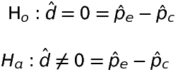
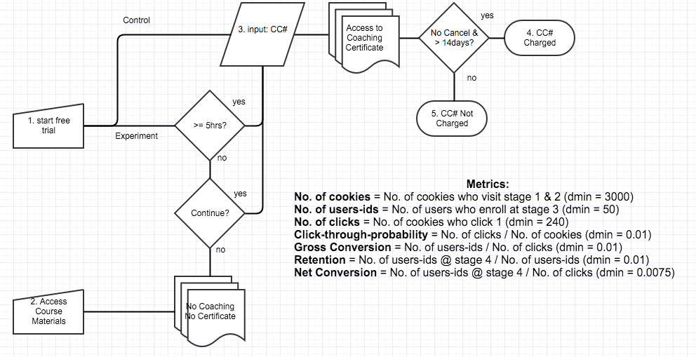
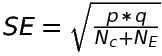
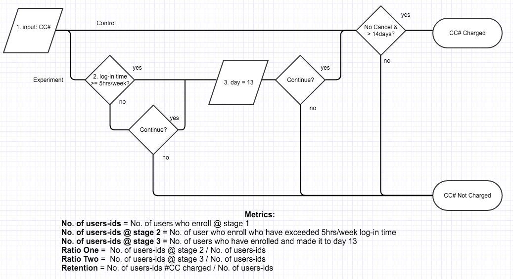

## Experiment Design
### Overview 
This document discusses an A/B test experiment that ran on the Udacity website in which the user was asked whether she or he had enough time to commit 5 hours per week to coursework.  The hope is that users will understand the time commitment required before embarking on a free trial that lasts 14 days.  After 14 days, he or she will be charged as a student who is enrolled in the certificate program at $199/month. 

The high-level business objective is to **reduce** the number of students who leave the free trial, while **not reducing** the number of students who continue to complete the certificate program.  The hypothesis tests are:

Pe stands for the probability of the experiment and Pc stands for the probability for the control. 

### Metric Choice
The logic flow of the experiment and control is below: 

 
In the experiment, a user clicks on "Start Free Trial," and then is asked about her or his time commitment.  In the control, a user is not asked about her or his time commitment.  The metrics, their classifications, and a short justification for their classifications are below:

|Metric| Baseline Value |Classification|Justification|
:--- |:--: |:--- | :--- 
Number of Cookies| 40,000 | Invariant| No change to course overview page
Number of User-Ids | 660 | Variant  | Expected decrease due to time commitment question
Number of Clicks | 3,200 |Invariant |No change to course overview page
Click-Through Probability | 0.08 |Invariant |No change to course overview page
Gross Conversion | 0.20625|Evaluation |Expected change due to time commitment question
Retention | 0.53|Evaluation |Expected change due to decrease in frustrated students and retention of students who complete certificate
Net Conversion | 0.1093125 |Evaluation | Expected change due to decrease in frustrated students and retention of students who complete certificate

Users will not be warned of time requirements at the course overview page.  Therefore, the metrics from the course overview page will not change.  The metrics from the course overview page are the number of cookies, the number of clicks, and the click-through probability (CTP), which is the number of clicks over the number of cookies.  These invariant metrics will be used as sanity checks. 

Depending on whether the user is diverted to the control or the experiment, the number of users-ids, those users who enroll, should change.  The number of user-ids could be an evaluation metric; it is not an evaluation metric, here,  because of increased variability due to day-to-day sampling.  Evaluating the average number of user-ids per day would be sensitive to outliers.  Gross conversion and net conversion are more robust.  Gross conversion and retention depend on the number of user-ids and change depending on whether the experiment changes the behavior of frustrated students.  Net conversion changes as well since the  experiment  might pre-screen for students who are more likely to complete the certificate program. 

The results that I will be on the look out for in order to launch the experiment are whether the experiment has an effect on decreasing the number of frustrated students while not reducing the number of students who complete the certificate.  These can be determined by the metrics gross conversion, retention, and net conversion.  

In order to launch the experiment, I am looking for a statistically significant and practically significant decrease in gross conversion, no statistically significant and practically significant decrease in net conversion, and -- ideally -- a statistically significant and practically significant increase in retention.  

A decrease in enrollments per clicks by itself would tell you that the time commitment message is working, but it provides no information on whether students who click are more likely to make the first payment.  Likewise, no discernible change in payments per clicks would provide no information to whether the warning message is working.  Together they provide a better story. 
 
## Measuring Standard Deviation
The analytical estimations of variance for gross and net conversion will suffice since the unit of analysis and the unit of diversion are the same: a cookie -- whereas the analytical estimation of variance for retention will underestimate since the unit of analysis and diversion are not the same: a user-id and a cookie, respectively[1](#myfootnote1).  Retention variability should be estimated empirically.  An empirical estimation of variance can be accomplished through A/A testing.  No A/A testing data was provided.  A coarse estimate based on available data was not advised.   Below is a table of the  analytical estimates.      

|Metric|Analytical Standard Deviation| 
:--- | :---: |
Gross Conversion | 0.0202 |
Retention | 0.0549 |
Net Conversion | 0.0156 |

## Sizing
### Number of Samples vs. Power
The Bonferroni correction is used when running multiple tests simultaneously; it is used to reduce the likelihood of a false positive from a family of tests[2](#myfootnote2).  I didn't apply the Bonferroni correction to the significance level (alpha = 0.05).  

My reasoning is based on my business objectives.  The Bonferroni does not assume independence[3](#myfootnote3).  Gross and net conversion are not independent based on a one-way ANOVA (R-squared = 0.43) and a Pearson's Chi-Square Test (p-value = 0.236).   My business objectives require that both of my hypotheses have significance, not one of them. 

If I were to applying the Bonferroni, I would decrease the significance level of each evaluation metric to ~0.05/2 = 0.025 or ~0.05/3, depending on which evaluation metrics (2 or 3) I ultimately ended up choosing.  For completion purposes, the numbers of pageviews required with the Bonferroni are below in the table.  Increasing the significance threshold of each metric would decrease the number of false positives (type I) and increase the number of false negatives (type II).    
 
Metric| Number of Pageviews (alpha = 0.05) | Number of Pageviews (Bonferroni)  
:--- | :---: | :---:  
Gross Conversion | 645875 | 825350 
Retention | 4741212 | 6062182
Net Conversion | 685325 | 875400 

The table above displays the number of pageviews needed in order to power the experiment appropriately.  The evaluation metric retention was dropped since it would lead to a number of pageviews that would not support a reasonable duration, assuming no change to the practical significance levels, alpha, or beta.    

## Duration vs. Exposure
The experiment lasted 37 days,  spanning from 10/11 to 11/26.  Since the free trial lasts 14 days, the available data are reduced to 23 days, spanning from 10/11 to 11/2.  The experiment was ran at 100%.  

No information was given about other Udacity experiments.  No information was given about the required business rhythm turnaround.  The assumptions were: 

1. no other experiments are running 
2. the fastest turnaround is required
3. day-to-day, week-to-week, or weekend variation is not a concern  

The risk to divert traffic is minimal per first principles.  The users will not be exposed to physical, psychological and emotional, social, and economic concerns.  The table below displays the estimated duration based on the required number or pageviews. 

Number of Pageviews | Estimated Duration (Days)  
:--- | :---: 
|685325 |  18 

## Experiment Analysis
### Sanity Checks

The sanity checks had these assumptions: (1) binomial distribution (p = 0.5, q = 0.5); and (2) central limit theorem Z-score  of 1.96.  The standard error was calculated: 

Here, Ne and Nc are the number of samples in the experiment and control, respectively.  The observed values below are from the control group.  They are within the 95% confidence interval of an analytical estimate of 0.5.        

|Metric|Lower Bound |Upper Bound| Observed| Passes?
:--- | :---: | :---: | :---: | :---: 
Number of Cookies| 0.4988| 0.5012 | 0.5006 | Y
Number of Clicks | 0.4959| 0.5041| 0.5005 |Y
Click-Through Probability | 0.0812| 0.0830 | 0.0822|Y

## Result Analysis
### Effect Size Tests

Metric|Lower Bound |Upper Bound| Statistical Significance Boundary | Statistically Significant?| Practical Significance Boundary| Practically Significant?
:--- | :---: | :---: | :---: | :---: | :-: | :--:
Gross Conversion| -0.0291| -0.0120 | 0 |Y| +/- 0.01 | Y
Net Conversion | -0.0116| 0.0019| 0| N| +/- 0.0075|N

Gross Conversion is statistically significant because the confidence interval [-0.0291,-0.0120] **does not** include zero.  The difference between the experiment and control are statistically significant. Gross Conversion is practically significant because the confidence interval above **does not** include the practical significance boundary 0.01.  An assurance exists that the confidence interval is below the practical significance boundary.  The results display a decrease in enrollments per clicks.       

Net Conversion is **not** statistically significant because the the confidence interval [-0.0116, 0.0019] includes zero.  Net Conversion is not practically significant since net conversion is not statistically significant.  Net Conversion is **not** practically significant because the confidence interval [-0.0116, 0.0019] **does** include the practical significance boundary -0.0075.  The number of payments per click has not definitively changed from the experiment and the control. 

### Sign Tests
The sign test is used to measure the likelihood of consistent differences between a pair of observations.  It assumes the probability distribution of the binomial (success/failure).  It is used here to corroborate the findings of whether a statistical significant difference was observed.  For gross conversion, four days out of twenty-three days had an experiment greater than the control.  For net conversion, ten days out of twenty-three days had an experiment greater than the control.  Assuming an equal likelihood of success or failure (50%) and an alpha of 0.05, the p-values for gross and net conversion are below: 

Metric| p-value| Statistically Significant?|
:--- | :--- | :---: 
Gross Conversion| 0.0026|  Y 
Net Conversion | 0.6776| N

A  p-value of 0.0026 is the likelihood of observing four or fewer success or days in which the difference between the experiment was greater than the control.  This is a low likelihood that this occurred by chance.  On the other hand of the spectrum, a  p-value of 0.6776 is the likelihood of observing 10 or fewer success or days in which the difference between the experiment was greater than the control.  This is highly likely and chance cannot be ruled out.  These results corroborate with the findings above in the effect size section.

### Summary
An experiment was ran on the Udacity website. The null hypothesis is that no change was observed due to this experiment.  The alternative hypothesis is that a change was observed.  Gross and net conversion were chosen as evaluation metrics.  Each of these metrics are important for making a recommendation.  Each of these metrics are tested against the hypotheses above.  The Bonferroni correction would increase the confidence interval of each of metrics, decreasing the likelihood of measuring an effect size that doesn't exist.  This is a problem that occurs more likely when simultaneously running a family of hypothesis tests, any one of which could be deemed significant.  The Udacity experiment doesn't need this correction since all of the evaluation metrics are used for making a recommendation. 

A practically and statistically significant effect was observed for gross conversion. A practically and statistically significant effect was not observed for net conversion.  The sign tests corroborated the effect size results. 

### Recommendation
My recommendation is based on the evaluation metrics gross conversion and net conversion and not retention.  My recommendation could potentially change based on new inputs from external data or data from the metric retention.  I recommend that the experiment not launch.  My decision is based on the following: 

+ A decrease in enrollments per clicks was observed with the experiment.  
+ No definitive negative change was observed for net conversion or students who make the first payment per click.  

The goal was to reduce the number of frustrated students and not reduce the number of students who pay.  If frustrated students are synonymous with gross conversion or those who enroll per click, then the experiment accomplished a practical and significant reduction.  If payments over clicks is synonymous with net conversion or students who pay per click, then the experiment accomplished no significant or practical change.  Net conversion experienced a decrease but not significant enough to merit rejection of the null.  The experiment met the high-level business objectives, but an ambiguity exists about the loss of the number of students who pay.  The practically significant boundary is -0.0075 and the confidence interval contains that boundary.  The observed decrease may exist below or above the practically significant boundary.  The observed effect may have negative unsustainable consequences.    

The evaluation metric retention didn't have enough statistical power to be assessed in this experiment.   Increasing alpha, decreasing beta, and increasing the practical significance would decrease the number of pageviews needed and but would produce less rigorous results that would be prone to detecting effects that do not exist.  The only way retention as defined in this experiment could be assessed is to increase the duration of the experiment.  Assessing retention could potentially give insight into whether or not the overall experience is better, which may be out of scope for this experiment due to duration requirements.  If the experience is better then students who are enrolled would make payments at a higher rate.        

### Follow-Up Experiment
To assess the number of frustrated students who cancel early in the course, the experiment that I would try is to warn the students who have enrolled and have not exceed 5hrs of log-in time per week, whether they wanted to continue with the free trial, and then again re-warn the student on day 13 of the trial whether they wanted to continue with the free trial which ends the next day.  My hypothesis is that the those students who have not exceeded 5 hours/week on the free trial will most likely leave the trial decreasing their classification as frustrated.  Similarly, my hypothesis is that those who are close to the end of their trial will have made a decision as to continue with signing up for certificate program or not on day 13.  Thus, a frustrated student will not be charged.  The logic flow that I am considering is below: 

The unit of diversion would be users-ids.  The definition of my metrics are above.  My reasoning for ratio one is to see whether students leave at a higher rate due to not committing 5 hours per week; my reasoning for ratio two is to see whether students leave at a higher rate due to duration requirements.  Depending on the results, a follow-up test would be to see whether perhaps the duration requirement of 14 days is enough.   

### References

<a name="myfootnote1">1 </a>:  http://bit.ly/1VH3R3u

<a name="myfootnote2">2 </a>:  http://www.stat.berkeley.edu/~mgoldman/Section0402.pdf

<a name="myfootnote3">3 </a>:  http://www.utdallas.edu/~herve/Abdi-Bonferroni2007-pretty.pdf
