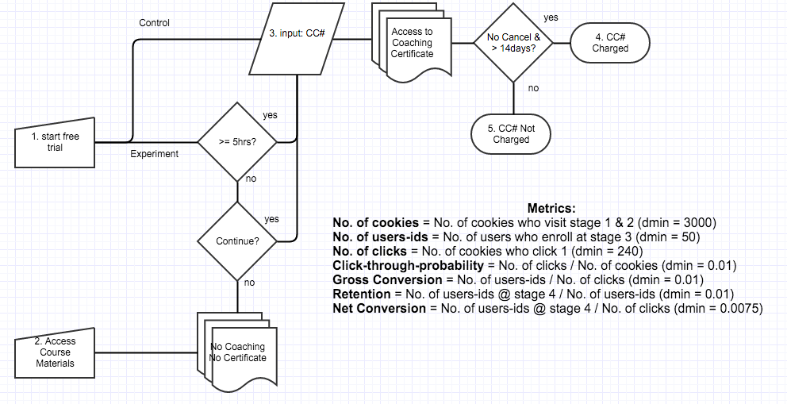
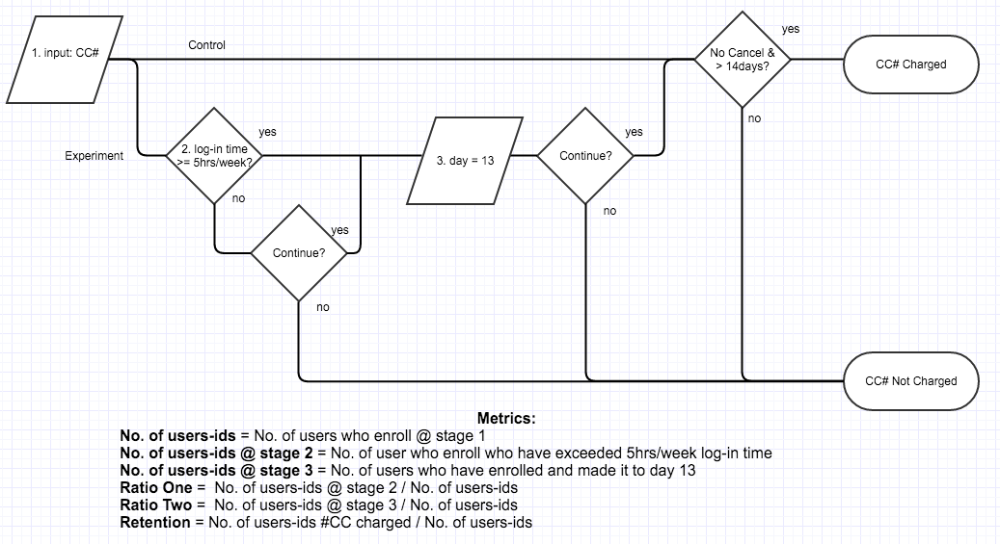

##Experiment Design
### Overview 
This document discusses an A/B test experiment that was ran on the Udacity website in which the user was asked whether she or he had enough time to commit 5 hours a week to coursework.  The hope is that users will understand the time commitment required before embarking on a free trial that lasts 14 days.  After 14 days, they will be charged as a student enrolled in a certificate program at $200/month. 

The high-level business objective is to reduce the number of students who leave the free trial, while preserving the number of students who continue to complete the certificate program.

###Metric Choice
The logic flow of the experiment and control is below: 

 
In the experiment, a user clicks on "Start Free Trial," and then is asked about her or his time commitment.  In the control, a user is not asked about her or his time commitment.  The metrics, their classifications, and a short justification for their classifications are below:

|Metric|Classification|Justification|
:--- | :--- | :---
Number of Cookies| Invariant| No change to course overview page
Number of User-Ids | Not invariant  | Not directly evaulated but not invariant
Number of Clicks | Invariant |No change to course overview page
Click-Through Probability |Invariant |No change to course overview page
Gross Conversion | Evaluation |Expected change due to time commitment questioning
Retention | Evaluation | Expected change due to decrease in frustrated students and retention of students who complete certificate
Net Conversion | Evaluation | Expected change due to decrease in frustrated students and retention of students who complete certificate

No user  will be warned of time requirements at the course overview page.  Therefore, the metrics from the course overview page will not change.  The metrics from the course overview page are the number of cookies, the number of clicks, and the click-through probability (CTP), which is the number of clicks over the number of cookies.  These invariant metrics will be used as sanity checks. 

Depending on whether the user is diverted to the control or the experiment, the number of users-ids, those users who enroll, could change.  The number of user-ids is not an invariant because it could change;  however, it is not a direct evaluation metric because it is rolled-up into other evaluation metrics and it does not directly measure the number of frustrated students or the number of students who complete the certification.  Similarly, gross conversion and retention that are dependent on the number of user-ids are also subject to change depending on whether the experiment has a change on the behavior of frustrated students.  Net conversion could change as well if the  experiment  pre-screens for students who are more likely to complete the certificate program. 

The results that I will be on the look out for in order to launch the experiment are whether the experiment has an effect on decreasing the number of frustrated students while retaining the number of students who complete the certificate.  These can be determined by the metrics gross conversion, retention, and net conversion.  

In order to launch the experiment, I am looking for a statistically significant and practically significant decrease in gross conversion, no statistically significant and practically significant increase or decrease in net conversion, and -- ideally -- a statistically significant and practically significant increase in retention.  

A decrease in enrollments per clicks by itself would tell you that the warning message is working, but it provides no information on whether students who click are more likely to make the first payment.  Likewise, no discernible change in payments per clicks would provide no information to whether the warning message is working.  Together they provide a better story. 
 
##Measuring Standard Deviation

A rule of thumb that is that analytical estimates tend to underestimate variability.  Therefore, it is not surprising that analytical estimates would be smaller than empirical estimates.  The table below shows the analytical estimate of variability and the coarse estimates of standard deviation of the control and the experiment.  The empirical coarse estimates are greater than the analytical estimates.  The empirical variability was not calculated with A/A tests.  The coarse estimates below are not used for calculations.  They are simply here to compare magnitudes.   

|Metric|Estimated Standard Deviation| Observed Standard Deviation - Control | Observed Standard Deviation - Experiment  
:--- | :---: | :---: | :--: |
Gross Conversion | 0.0202 | 0.0440 | 0.0475|
Retention | 0.0549 | 0.0943|  0.1276|
Net Conversion | 0.0156 | 0.0294 | 0.0322|

The analytical estimates of variance for gross conversion and net conversion use a unit of analysis of clicks per day equal to 400.  The experiment and control on average had ~760 clicks per day.  This could be one source for the difference seen between the analytical and empirical.  The analytical estimate of variance for retention uses a unit of analysis of enrollments per day equal to 82.5 enrollments per day.  The experiment and control on average had ~150 enrollments per day. 

##Sizing
###Number of Samples vs. Power
The Bonferroni correction was not used since its conservativeness would lead to an increased number of pageviews.  Similarly, the evaluation metric retention was dropped since it would lead to a number of pageviews that would not support a reasonable duration, assuming no change to the practical significance levels, alpha, or beta.    

Metric| Number of Pageviews (alpha = 0.05) | Number of Pageviews (Bonferroni)  
:--- | :---: | :---: | 
Gross Conversion | 645875 | 825350 |
Retention | 4741212 | 6062182|
Net Conversion | 685325 | 875400 |

The table above displays the number of pageviews needed in order to power the experiment appropriately.  

##Duration vs. Exposure
I chose to divert traffic by 50%.   The diversion allows an adequate sample of the spread across multiple weeks to reduce day-by-day, or week-by-week variation.  

The risks could be a loss of payments that could happen due to an increase use of the coaches time that decreases the experience and payments, and a loss of people who enroll.  On average with the  "as-is" condition, the number of first payments is roughly (0.53)x(660) = 350 per day.  The amount of money generated is ($200)x(350) = $69,960 per day.  A worst case scenario would be that the experiment would decrease first payments to zero.  With only 50% of the traffic seeing the experiment, the worst case loss would be $34,980 per day.  This is not a realistic loss and other factors are at play but nonetheless the example demonstrates that it is quite a gamble to run your traffic at 100%.  The risk of not properly allocating coaching resources or creating a step-change to the student experience could impact the business as well.  Lastly, if the experiment decreases enrollment then payments will be impacted as well.    

Number of Pageviews | Duration (Days)  
:--- | :---: | :---: | 
|685325 |  35 |

The durations for the control and experiment were 37 days. 

##Experiment Analysis
###Sanity Checks

|Metric|Lower Bound |Upper Bound| Observed| Passes?
:--- | :---: | :---: | :---: | :---: |
Number of Cookies| 0.4988| 0.5012 | 0.5006 | Y
Number of Clicks | 0.4959| 0.5041| 0.5005 |Y
Click-Through Probability | 0.0812| 0.0830 | 0.0822|Y

The invariant metrics are sane. 

##Result Analysis
###Effect Size Tests
Metric|Lower Bound |Upper Bound| Statistically Significant?| Practically Significant?|
:--- | :---: | :---: | :--- | :---
Gross Conversion| -0.0291| -0.0120 | Y | Y
Net Conversion | -0.0116| 0.0019| N |N

Gross Conversion is statistically significant because the confidence interval [-0.0291,-0.0120] **does not** include zero.  The difference between the experiment and control are statistically significant. Gross Conversion is practically significant because the confidence interval above **does not** include the practical significance boundary 0.01.  An assurance exists that the confidence interval is below the practical significance boundary.  The results display a decrease in enrollments per clicks.       

Net Conversion is **not** statistically significant because the the confidence interval [-0.0116, 0.0019] includes zero.  Net Conversion is not practically significant since Net Conversion is not statistically significant.  Net Conversion is **not** practically significant, though the confidence interval [-0.0116, 0.0019] **does not** contains the practical significance boundary 0.0075.  An assurance exists that the CI is below the practical significance level.  The number of payments per click has not definitively changed from the experiment and the control. 

###Sign Tests
Metric| p-value| Statistically Significant?|
:--- | :--- | :---: 
Gross Conversion| 0.0026|  Y 
Net Conversion | 0.6776| N

###Summary
I didn't use a Bonferroni correction.  The conservatism of the Bonferroni correction requires more pageviews.  The Bonferroni correction requires a more conservative alpha, namely 0.05/3 or 0.05/2, depending on which evaluation metrics are chosen.  The more evaluation metrics chosen, the higher level of conservativeness is required, and the larger number of pageviews required to power the experiment.  

###Recommendation
My recommendation is based on the evaluation metrics Gross Conversion and Net Conversion and not Retention.  My recommendation could potentially change based on new inputs from external data or data from the metric Retention.  I recommend that the experiment launch.  My decision is based on the following: 

+ A decrease in enrollments per clicks was observed with the experiment.  
+ No definitive change was observed for net conversion or students who make the first payment per click.  

The goal was to reduce the number of frustrated students and maintain students who pay.  If frustrated students are synonymous with gross conversion or those who enroll per click, then the experiment accomplished a practical and significant reduction.  If payments over clicks is synonymous with net conversion or students who pay per click, then the experiment accomplished no significant or practical change.  The experiment met the high-level business objectives. 

The evaluation metric Retention didn't have enough conversational statistical power to be assessed in this experiment.   Increasing alpha, decreasing beta, and increasing the practical significance would decrease the number of pageviews needed and but would produce less rigorous results that would be prone to detecting effects that do not exist.  The only way Retention as defined in this experiment could be assessed is to increase the duration of the experiment.  Assessing Retention could potentially give insight into whether or not the overall experience is better, which may be out of scope for this experiment due to duration requirements.  If the experience is better then students who are enrolled would make payments at a higher rate.        

###Follow-Up Experiment
To assess the number of frustrated students who cancel early in the course, the experiment that I would try is to warn the students who have enrolled and have not exceed 5hrs of log-in time per week, whether they wanted to continue with the free trial, and then again re-warn the student on day 13 of the trial whether they wanted to continue with the free trial which ends the next day.  My hypothesis is that the those students who have not exceeded 5 hours/week on the free trial will most likely leave the trial decreasing their classification as frustrated.  Similarly, my hypothesis is that those who are close to the end of their trial will have made a decision as to continue with signing up for certificate program or not on day 13.  Thus, a frustrated student will not be charged.  The logic flow that I am considering is below: 

The unit of diversion would be users-ids.  The definition of my metrics are above.  My reasoning for ratio one is to see whether students leave at a higher rate due to not committing 5 hours per week; my reasoning for ratio two is to see whether students leave at a higher rate due to duration requirements.  Depending on the results, a follow-up-follow-up test would be to see whether perhaps the duration requirement of 14 days is enough.   