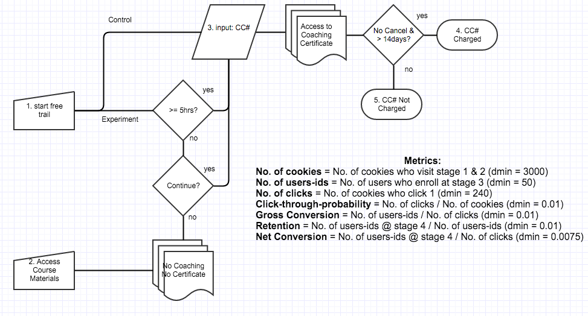
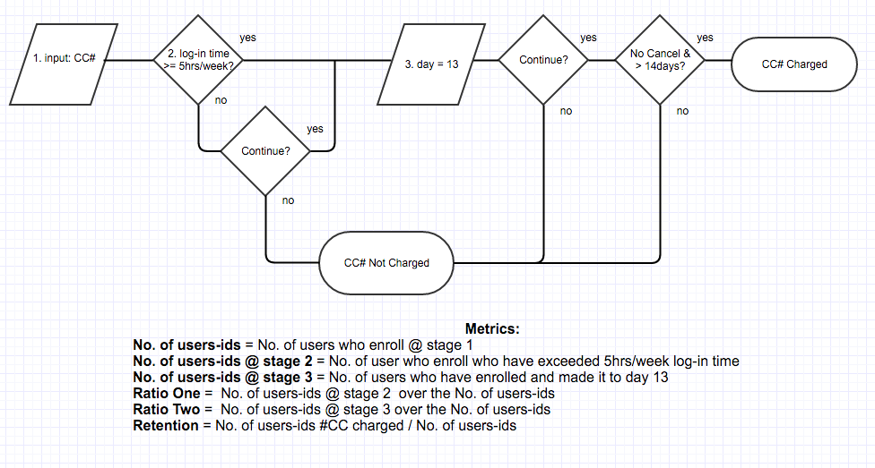

##Experiment Design
###Metric Choice

**You should also decide now what results you will be looking for in order to launch the experiment**.  In order to launch the experiment, I am looking for a statistically significant and practically significant decrease in gross conversion, no statistically significant and practical significant increase or decrease in net conversion, and a statistically significant and practical significant increase in retention.  

**Would a change in any one of your evaluation metrics be sufficient?** 
No. **Why?** A decrease in enrollments per clicks by itself would tell you that the warning message is working, but it provides no information on whether students who click are more likely to make the first payment.  Likewise, no discernible change in payments per clicks would provide no information to whether the warning message is working.  Together they provide a better story. 

**Would you want to see multiple metrics all move or not move at the same time in order to launch? This decision will inform your choices while designing the experiment.**

Some metrics that exist are a count, a rate, a probability, and a ratio.  First step is to interpret high-level business concepts into definitions based on the objective. The objective is to reduce the number of frustrated students who leave the free trial, while preserving the number of students who continue to complete the certificate program. 

List which metrics you will use as invariant metrics and evaluation metrics here. (These should be the same metrics you chose in the "Choosing Invariant Metrics" and "Choosing Evaluation Metrics" quizzes.)

For each metric, explain both why you did or did not use it as an invariant metric and why you did or did not use it as an evaluation metric. Also, state what results you will look for in your evaluation metrics in order to launch the experiment.

The high-level business objective is to reduce the number of frustrated students who leave the free trial, while preserving the number of students who continue to complete the certificate program.  The metrics, their classifications, their reference location on the logic flow diagram, and a short justification for their classifications are below:

|Metric|Classification|Reference| Justification|
:--- | :--- | :--- | 
Number of Cookies| Invariant| 0 | No change to course overview page
Number of User-Ids | Not invariant  | 3 | Not directly evaulated but not invariant
Number of Clicks | Invariant |1 |No change to course overview page
Click-Through Probability |Invariant | 2/0|No change to course overview page
Gross Conversion | Evaluation | 3/1 |Expected change due to time commitment questioning
Retention | Evaluation | 4/3| Expected change due to decrease in frustrated students and retention of students who complete certificate
Net Conversion | Evaluation | 4/1 |Expected change due to decrease in frustrated students and retention of students who complete certificate

No user  will be warned of time requirements at the course overview page.  Therefore, the metrics from the course overview page will not change.  The metrics from the course overview page are the number of cookies, the number of clicks, and the click-through probability (CTP), which is the number of clicks over the number of cookies.  These metrics will be used as sanity checks later. 

Depending on whether the user is diverted to the control or the experiment, the number of User-Ids, those users who enroll, could change.  The number of User-Ids is not an invariant because it could change;  however, it is not an a direct evaluation metric because it is rolled-up into other evaluation metrics and it does not directly measure the number of frustrated students or the number of students who complete the certification.  Similarly, the gross conversion and the retention that are dependent on the number of User-Ids, are also subject to change depending on whether the experiment has a change on the behavior of frustrated students.  Net conversion could change as well if the  experiment  pre-screens for students who are more likely to complete the certificate program. 

The results that I will be on the look out for in order to launch the experiment are whether the experiment has an effect on decreasing the number of frustrated students while retaining the number of students who complete the certificate.  These can be determined by the metrics gross conversion, retention, and net conversion.  I will look at these metrics for statistical significance and practical significance.  I will also look at the invariants to ensure sanity. 

 
##Measuring Standard Deviation
List the standard deviation of each of your evaluation metrics. (These should be the answers from the "Calculating standard deviation" quiz.) 

For each metric you selected as an evaluation metric, estimate its standard deviation analytically. Do expect the analytic estimates to be accurate? That is, for which metrics, if any, would you want to collect an empirical estimate of the variability if you had time?

|Metric|Estimated Standard Deviation| Observed Standard Deviation - Control | Observed Standard Deviation - Experiment  
:--- | :---: | :---: | :--: |
Gross Conversion | 0.0202 | 0.0440 | 0.0475|
Retention | 0.0549 | 0.0943|  0.1276|
Net Conversion | 0.0156 | 0.0294 | 0.0322|

For each of your evaluation metrics, indicate whether you think the analytic estimate would be comparable to the the empirical variability, or whether you expect them to be different (in which case it might be worth doing an empirical estimate if there is time). Briefly give your reasoning in each case.

A rule of thumb that was mentioned in the lectures is that analytical estimates tend to underestimate variability.  Therefore, it is not surprising that the analytical estimates would be smaller than an empirical estimates.  The table above shows the coarse estimation of standard deviation of the control and the experiment.  The empirical coarse estimates are greater than the analytical estimates.  The data provided did not give A/A tests to estimate the standard deviation.  The coarse estimates above are not used for calculations.  They are simply here to compare magnitudes.   

The analytical estimates of variance for gross conversion and net conversion use a unit of analysis of clicks per day equal to 400.  The experiment and control on average had ~760 clicks per day.  This could be one source for the difference seen between the analytical and empirical.  The analytical estimate of variance for retention uses a unit of analysis of enrollments per day equal to 82.5 enrollments per day.  The experiment and control on average had ~150 enrollments per day. 

##Sizing
###Number of Samples vs. Power
Indicate whether you will use the Bonferroni correction during your analysis phase, and give the number of pageviews you will need to power you experiment appropriately. (These should be the answers from the "Calculating Number of Pageviews" quiz.)

The Bonferroni correction was not used since its conservativeness would lead to an increased number of pageviews.  Similarly, the evaluation metric retention was dropped since it would lead to a number of pageviews that would not support a reasonable duration, assuming no change to the practical significance levels, alpha, or beta.    

Metric| Number of Pageviews (alpha = 0.05) | Number of Pageviews (Bonferroni)  
:--- | :---: | :---: | 
Gross Conversion | 645875 | 825350 |
Retention | 4741212 | 6062182|
Net Conversion | 685325 | 875400 |

The table above displays the number of pageviews needed in order to power the experiment appropriately.  

##Duration vs. Exposure
Indicate what fraction of traffic you would divert to this experiment and, given this, how many days you would need to run the experiment. (These should be the answers from the "Choosing Duration and Exposure" quiz.)

Give your reasoning for the fraction you chose to divert. How risky do you think this experiment would be for Udacity?

Given the percentage you chose, how long would the experiment take to run, using the analytic estimates of variance? If the answer is longer than a few weeks, then this is unreasonably long, and you should reconsider an earlier decision.

I chose to divert traffic by 50%.   The diversion allows an adequate sample of the spread across multiple weeks to reduce day-by-day, or week-by-week variation.  The risks could be a loss of payments that could happen due to an increase use of coaches that decreases the experience and payments, and a loss of people who enroll.  

On average with the  "as-is" condition, the number of first payments is roughly 0.53*660 = 350 per day.  The amount of money generated is $200*350 = $69,960 per day.  A worst case scenario would be that the experiment would decrease first payments to zero.  With only 50% of the traffic seeing the experiment, the worst case loss would be $34,980 per day.  This is not a realistic loss and other factors are at play but nonetheless the example demonstrates that it is quite a gamble to run your traffic at 100%.  The risk of not properly allocating coaching resources or creating a step-change to the student experience could impact the business as well.  Lastly, if the experiment decreases enrollment then payments will be impacted as well.    

Number of Pageviews | Duration (Days)  
:--- | :---: | :---: | 
|685325 |  35 |

##Experiment Analysis
###Sanity Checks
For each of your invariant metrics, give the 95% confidence interval for the value you expect to observe, the actual observed value, and whether the metric passes your sanity check. (These should be the answers from the "Sanity Checks" quiz.)

For any sanity check that did not pass, explain your best guess as to what went wrong based on the day-by-day data. Do not proceed to the rest of the analysis unless all sanity checks pass.

|Metric|Lower Bound |Upper Bound| Observed| Passes?
:--- | :---: | :---: | :---: | :---: |
Number of Cookies| 0.4988| 0.5012 | 0.5006 | Y
Number of Clicks | 0.4959| 0.5041| 0.5005 |Y
Click-Through Probability | 0.0812| 0.0830 | 0.0822|Y

##Result Analysis
###Effect Size Tests
For each of your evaluation metrics, give a 95% confidence interval around the difference between the experiment and control groups. Indicate whether each metric is statistically and practically significant. (These should be the answers from the "Effect Size Tests" quiz.)

Metric|Lower Bound |Upper Bound| Statistically Significant?| Practically Significant?|
:--- | :--- | :--- | :--- | :---
Gross Conversion| -0.0291| -0.0120 | Y | Y
Net Conversion | -0.0116| 0.0019| N |N

###Sign Tests
For each of your evaluation metrics, do a sign test using the day-by-day data, and report the p-value of the sign test and whether the result is statistically significant. (These should be the answers from the "Sign Tests" quiz.)

Metric| p-value| Statistically Significant?|
:--- | :--- | :---: 
Gross Conversion| 0.0026|  Y 
Net Conversion | 0.6776| N

###Summary
State whether you used the Bonferroni correction, and explain why or why not. If there are any discrepancies between the effect size hypothesis tests and the sign tests, describe the discrepancy and why you think it arose.

I didn't use a Bonferroni correction.  The conservatism of the Bonferroni correction requires more pageviews.   

###Recommendation
Make a recommendation and briefly describe your reasoning.
Finally, make a recommendation. Would you launch this experiment, not launch it, dig deeper, run a follow-up experiment, or is it a judgment call? If you would dig deeper, explain what area you would investigate. If you would run follow-up experiments, briefIy describe that experiment. If it is a judgment call, explain what factors would be relevant to the decision.

Gross Conversion is statistically significant because the confidence interval [-0.0291,-0.0120] **does not** include zero.  The difference between the experiment and control are statistically significant. 
 Gross Conversion is practically significant because the confidence interval above **does not** include the practical significance boundary 0.01.  An assurance exists that the confidence interval is below the practical significance boundary.  The results display a decrease in enrollments per clicks.       

Net Conversion is **not** statistically significant because the the confidence interval [-0.0116, 0.0019] includes zero.  Net Conversion is not practically significant since Net Conversion is not statistically significant.  Net Conversion is **not** practically significant, though the confidence interval [-0.0116, 0.0019] **does not** contains the practical significance boundary 0.0075.  An assurance exists that the CI is below the practical significance level.  The number of payments per click has not definitively changed from the experiment and the control. 

My recommendation is based on the evaluation metrics Gross Conversion and Net Conversion and not Retention.  My recommendation could potentially change based on new inputs from external data or data from the metric Retention.  I recommend that the experiment launch.  My decision is based on the following: 

+ A decrease in enrollments per clicks was observed with the experiment.  
+ No definitive change was observed for net conversion or students who make the first payment per click.  

The goal was to reduce the number of frustrated students and maintain students who pay.  If frustrated students are synonymous with gross conversion or those who enroll per click, then the experiment accomplished a practical and significant reduction.  If payments over clicks is synonymous with net conversion or students who pay per click, then the experiment accomplished no significant or practical change.  The experiment met the high-level business objectives. 

The evaluation metric Retention didn't have enough conversational statistical power to be assessed in this experiment.   Increasing alpha, decreasing beta, and increasing the practical significance would decrease the number of pageviews needed and but would produce less rigorous results that would be prone to detecting effects that do not exist.  The only way Retention as defined in this experiment could be assessed is to increase the duration of the experiment.  Assessing Retention could potentially give insight into whether or not the overall experience is better, which may be out of scope for this experiment due to duration requirements.  If the experience is better then students who are enrolled would make payments at a higher rate.        

###Follow-Up Experiment
Give a high-level description of the follow up experiment you would run, what your hypothesis would be, what metrics you would want to measure, what your unit of diversion would be, and your reasoning for these choices.

If you wanted to reduce the number of frustrated students who cancel early in the course, what experiment would you try? Give a brief description of the change you would make, what your hypothesis would be about the effect of the change, what metrics you would want to measure, and what unit of diversion you would use. Include an explanation of each of your choices.

To assess the number of frustrated students who cancel early in the course, the experiment that I would try is to warn the students who have enrolled and not exceed 5hrs of log-in time per week, whether they wanted to continue with the free trial, and then again warn the student on day 13 of the trail whether they want to continue with the free trail which ends the next day.  My hypothesis is that the those students who have not exceeded 5 hours/week on the free trail will most likely leave the trail decreasing their frustration.  Similarly, my hypothesis is that those who are close to the end of their trail will have made a decision as to continue with signing up for certificate program or not on day 13.  Thus, a frustrated student will not be charged.  The logic flow that I am considering is below: 

###Additional Questions: 
*keyword: difficult metrics*

+ Are there any results or metrics that would be enhanced by surveys, retrospective analyses, focus groups etc. ? 
+ Don't have access to data or metric takes too long to observe? 
+ Can I create a new metric? 
+ Can I compare the given metrics to external data such as no. of cookies, no. of completions to Nielson's, etc.? Hit-wise? 
+ Do we see any disportionate results when we filter or segment the data week-by-week, year-by-year?  
+ Have we looked at the distrutions? The control distributions don't look normal but this could be attributed to the sampling which is only 37 days. 
+ Can we split this up per week and weekend? 
+ Have we calculated whether the sample size is adequate for the experiment? Do we have enough power? 
+ How does weekend traffic look?
+ Do we have to explore whether something is incorrect? 
+ Is a learning effect taking place? 

If you have chosen multiple evaluation metrics, you will need to decide whether to use the Bonferroni correction. When deciding, keep in mind the results you are looking for in order to launch the experiment. Will the fact that you have multiple metrics make those results more likely to occur by chance than the alpha level of 0.05?
